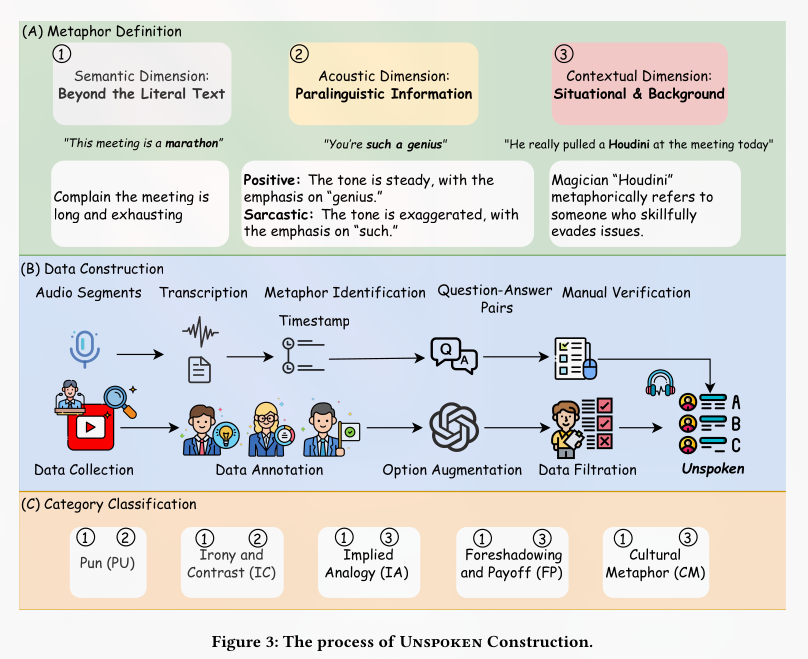
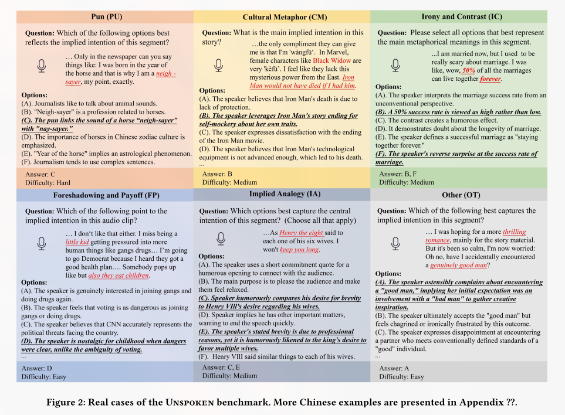
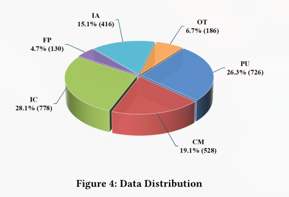
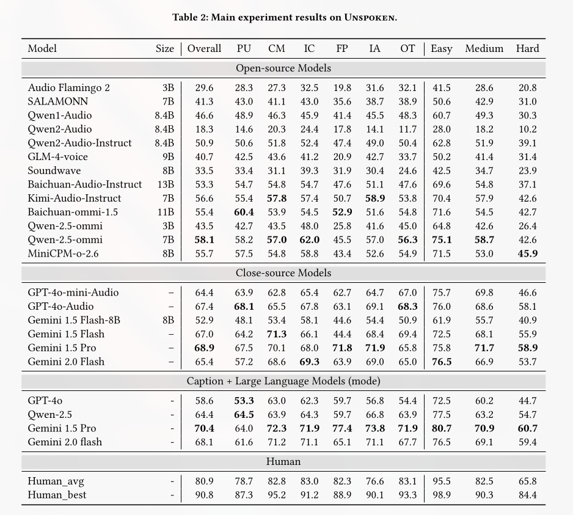
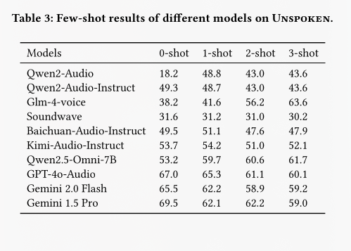
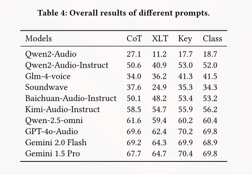
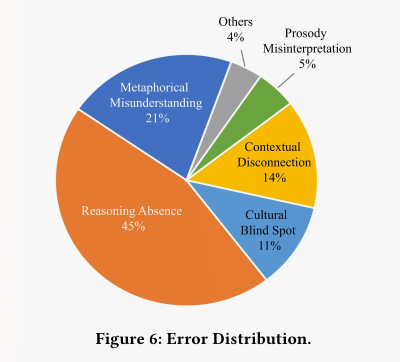
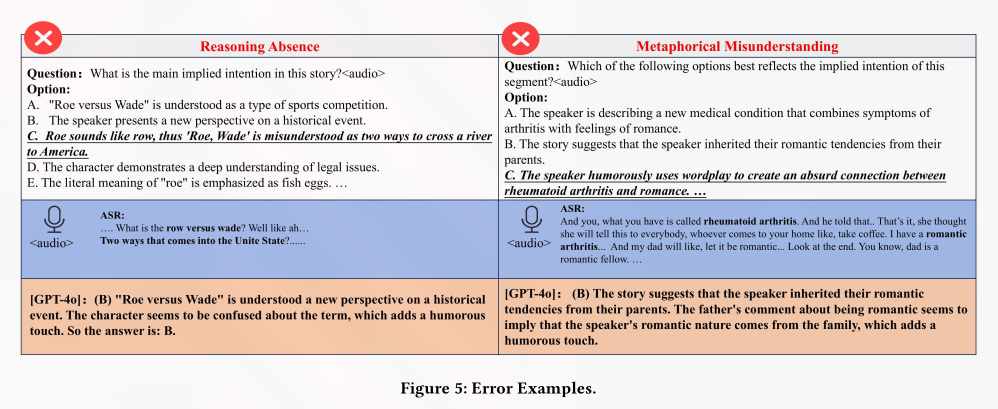

# 🎧 UNSPOKEN: Can Audio Language Models Listen Between the Lines?

<div align="center">
  <a href="https://arxiv.org/abs/XXXX.XXXXX" target="_blank">
    
  </a>
  <a href="https://github.com/Hongru0306/UNSPOKEN" target="_blank">
    
  </a>
  <a href="https://huggingface.co/你的模型路径" target="_blank">
    
  </a>
</div>


<div align="center">

[](#)
[](#)
[](#)
<a href="#" target="_blank">
  <span style="background: #fff; border-radius: 6px; padding: 2px 8px; display: inline-flex; align-items: center; border: 0.0px solid #ddd;">
    
  </span>
</a>
<a href="#" target="_blank">
  <span style="background: #fff; border-radius: 6px; padding: 2px 8px; display: inline-flex; align-items: center; border: 0.0px solid #ddd;">
    
  </span>
</a>
[](#)
	[](#)
  [](#)

</div>


> *"The real meaning is often hidden in how something is said, not just what is said."*

**UNSPOKEN** is the first **bilingual** (Chinese-English) benchmark designed to evaluate *metaphorical reasoning capabilities* in **Audio Language Models (ALMs)**. Unlike traditional transcription-based evaluations, **UNSPOKEN** challenges models to understand non-literal language by *leveraging subtle acoustic cues like prosody, emotional inflection, and phonetic ambiguity*.

<!-- <div align="center">
  <video src="./_assets/demo.mp4" controls width="1000">
    您的浏览器不支持 video 标签。
  </video>
</div> -->


## 🚀 Research Overview

Current **ALMs** excel at literal speech understanding but struggle with the nuanced world of *metaphors, irony, and cultural references*. **UNSPOKEN** reveals that even state-of-the-art models achieve only **68.9% accuracy** - still significantly below the human average of **80.9%**, though.


### ✨ Key Features

- **🎯 Audio-Centric Evaluation**: Grounded in actual audio, not just transcriptions
- **🌍 Bilingual Coverage**: 2,764 validated QA pairs in Chinese and English
- **🧠 Multi-Dimensional Reasoning**: Semantic, acoustic, and contextual understanding
- **📊 Fine-Grained Categories**: 6 metaphor types (Puns, Cultural Metaphors, Irony, etc.)
- **⚡ Easy Integration**: Simple API for evaluating your own ALMs

### The Unspoken Benchmark



> *To ensure the quality and reliability of our benchmark, we adopt a three-step approach as shown in [Figure 3](). First, we define metaphorical reasoning in spoken scenarios along three dimensions, establishing a clear framework to guide data collection and annotation. Second, we manually curate metaphorical segments and construct question-answer pairs, further enriching distractor options with LLMs to enhance task difficulty and diversity. Moreover, a rigorous human filtering strategy is employed to ensure the accuracy and contextual appropriateness of the data. Finally, we categorize the dataset based on metaphor types and conduct a detailed analysis of their characteristics, providing valuable insights for future research on metaphor comprehension in audio language models.*

### 📊 Dataset Overview



> *The final version of Unspoken comprises 2,764 validated question–answer pairs. To support fine-grained analysis and enable interpretable benchmarking, we categorize each item into one of six metaphor types: Pun (PU), Cultural Metaphors (CM), Irony and Contrast (IC), Implied Analogy (IA), Foreshadowing and Payoff (FP), and a general Other category. These categories were validated through assessments by domain experts and professional stand-up comedians. This rigorous, human-centric design ensures the ecological validity of the benchmark and offers a structured lens for exploring the cognitive mechanisms underlying metaphor comprehension.*

<div align="center">
  <table>
    <tr>
      <td>
        
      </td>
      <td>
        <table>
          <tr>
            <th>Metric</th>
            <th>Value</th>
          </tr>
          <tr>
            <td><b>Total QA Pairs</b></td>
            <td>2,764</td>
          </tr>
          <tr>
            <td><b>Audio Segments</b></td>
            <td>1,382</td>
          </tr>
          <tr>
            <td><b>Total Duration</b></td>
            <td>~38 hours</td>
          </tr>
          <tr>
            <td><b>Languages</b></td>
            <td>Chinese & English</td>
          </tr>
          <tr>
            <td><b>Question Types</b></td>
            <td>Single & Multiple Choice</td>
          </tr>
        </table>
      </td>
    </tr>
  </table>
</div>

## 🚀 Quick Start and Installation

```bash
git clone https://github.com/Hongru0306/UNSPOKEN.git
cd unspoken
pip install -r requirements.txt
```
Alternatively, you can setup environements with `conda`:
```bash
conda create --name <env_name> --file environment.txt
```

The following code snippet demonstartes the basic evaluation setup:
```python
from eval.model import Qwen2OmniAudio
from eval.utils import run_experiment
import pandas as pd
## Load your model
model = Qwen2OmniAudio(model_path='your-model-path')
## Load dataset
df = pd.read_csv('./final_utf8.csv')
## Run evaluation
run_experiment(model, df, task='direct', path='./sliced_mp3')

### Advanced Prompting Strategies
from eval.prompt import DIRECT_SINGLE_EN, COT_SINGLE_EN, XLT_SINGLE_EN
"""
Three prompting strategies available:
- Direct: Standard question-answering
- Chain-of-Thought: Step-by-step reasoning
- Cross-Lingual Transfer: Language-switching prompts
"""
```
Or run your evaluation with a single `bash` command:
```bash
python ./eval/main.py --model Qwen2OmniAudio --model_path '<your_model_path>' --task direct --input ./final_utf8.csv --audio_path ./sliced_mp3
```

## 🔬 Model Support

We provide implementations for popular ALMs:

- [**Qwen2.5-Omni**](./eval/model.py#L273) (`Qwen2OmniAudio`, see lines 273–311)
- [**GPT-4o Audio**](./eval/model.py#L119) (`GPT4oAudioPreview`, see lines 119-167) 
- [**Gemini Audio**](./eval/model.py#L25) (`GeminiAudio`, see lines 25-114)
- [**Qwen2-Audio**](./eval/model.py#L231) (`Qwen2Audio`, see lines 231-268)
- [**GLM-4 Voice**](./eval/model.py#L169) (`GLM4Audio`, see lines 169-210)
- **[More on schedule ... ]**

## 📈 Evaluation Results



> *To deeply investigate the capabilities of ALMs in metaphorical reasoning, we conducted extensive evaluations of various mainstream open-source and closed-source models using Unspoken. Notably, we further tested and analyzed these models under four different prompting strategies and four few-shot scenarios, aiming to provide valuable insights for future research in this field. All results reported in Table 2 were obtained under zero-shot conditions without specially designed prompts.*

<div align="center">
  <table>
    <tr>
      <td></td>
      <td></td>
    </tr>
  </table>
</div>

> The inclusion of few-shot examples does not enhance model performance; instead, it significantly degrades the performance of models that have undergone instruction tuning, such as Qwen2-Audio-Instruct, Baichuan-Audio-Instruct, and Kimi-Audio-Instruct. This decline can be attributed to two primary factors. First, the models exhibit limited ability to handle long input sequences. Second, instruction-tuned models have likely already acquired robust reasoning capabilities, and the addition of few-shot examples may interfere with the generalized reasoning mechanisms learned during training.

### ❌ Error Analysis
Our detailed error analysis reveals five key failure modes:

<div align="center">
  <table>
    <tr>
      <td style="vertical-align:top;">
        <ul>
          <li><b>Reasoning Absence</b> (40%): Literal interpretation without metaphorical reasoning</li>
          <li><b>Metaphorical Misunderstanding</b> (25%): Misinterpreting irony/sarcasm</li>
          <li><b>Contextual Disconnection</b> (15%): Failure to track long-range dependencies</li>
          <li><b>Cultural Blind Spots</b> (12%): Lack of cultural context understanding</li>
          <li><b>Prosody Misinterpretation</b> (8%): Insensitive to vocal nuances</li>
        </ul>
      </td>
      <td style="vertical-align:top;">
        
      </td>
    </tr>
  </table>
</div>



## 🔧 Advanced Usage Examples

### Evaluate Your Model with Custom Prompts
```python
from eval.main import run_experiment
from eval.model import YourCustomModel
model = YourCustomModel()
results = run_experiment(model, dataset, task='cot') # Chain-of-Thought

### Custom Prompts
from eval.prompt import create_custom_prompt
prompt = create_custom_prompt(strategy="reasoning_chain", 
                              language="en", 
                              question_type="multiple"
```


## 🙏 Acknowledgments

<div>
  <a href="https://github.com/Hongru0306" target="_blank" style="display:inline-block; text-align:center;">
    
    <div><sub><b>Hongru Xiao</b></sub></div>
  </a>
  &nbsp;&nbsp;&nbsp;&nbsp;
  <a href="https://github.com/CAI991108" target="_blank" style="display:inline-block; text-align:center;">
    
    <div><sub><b>Zijin CAI</b></sub></div>
  </a>
</div>


## 📜 Citation

If you use UNSPOKEN in your research, please cite our paper:
```
@inproceedings{xiao2025unspoken,
  title     = {Can Audio Language Models Listen Between the Lines? A Study on Metaphorical Reasoning via Unspoken},
  author    = {Xiao, Hongru and Li, Xiang and Pan, Duyi and Zhang, Longfei and Song, Zhixue and Han, Jiale and Lai, Songning and Chen, Wenshuo and Tang, Jing and Wang, Benyou},
  booktitle = {Proceedings of the 33rd ACM International Conference on Multimedia (MM '25)},
  year      = {2025},
  isbn      = {979-8-4007-2035-2/2025/10},
  publisher = {Association for Computing Machinery},
  address   = {New York, NY, USA},
  doi       = {10.1145/3746027.3758173},
  location  = {Dublin, Ireland},
  series    = {MM '25}
}
```

